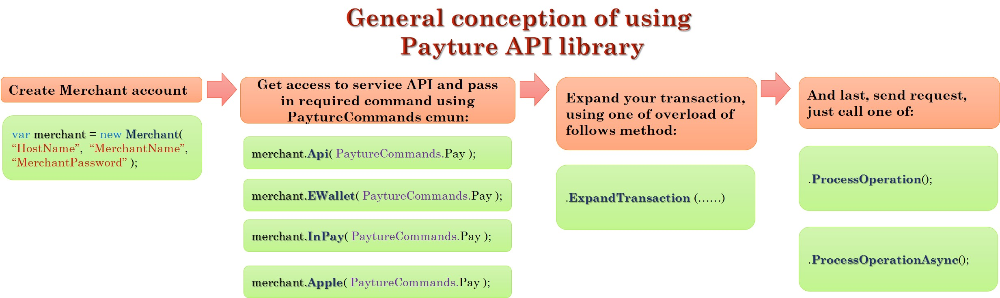

# CSharp-Payture-official

This is Offical Payture API for C#. We're try to make this as simple as possible for you! Explore tutorial and get started. Please note, you will need a Merchant account,  contact our support to get one. 
Here you can explore how to use our API functions!

## Install
Just download our package from NuGet *(please, take into account that this is the test package now)*:  **CSharpPaytureAPI**


And include to your project:
```c#
using CSharpPayture;
```

## Payture API tutorial
Before fall into the deep, we're need to provide you general conception of working with our API function. See picture: 


## [Steps](#newMerchant)

 * [Creating merchant account](#newMerchant)
 * [Get access to required API](#accessToAPI)
 * [Expand transaction](#expandTransaction)
 * [Send request](#sendRequest)

## [Base Types](#baseTypes)
* [PayInfo](#PayInfo)
* [Card](#Card)
* [Data](#Data)
* [PaytureCommands](#PaytureCommands)
* [Customer](#Customer)
* [PaytureResponse](#PaytureResponse)
* [CardInfo](#CardInfo)
* [Transaction](#Transaction)

## [Test App](#testApp)

Now, let's walk through the steps from the picture above


## First Step - Creating Merchant Account <a id="newMerchant"></a>
To get access for API usage just create the instance of Merchant object, pass in the constructor the name of the host, name of your account and your account password.  Suppose that you have Merchant account with  name: Key = "MyMerchantAccount" and password Password = "MyPassword".

Pass the 'https://sandbox.payture.com' for test as the name of Host (first parameter).
```c#
var merchant = new Merchant("https://sandbox.payture.com", "MyMerchantAccount", "MyPassword");
```
We're completed the first step! Go next!
***
Please note, that  Key = "'MyMerchantAccount" and Password = "MyMerchantAccount"  - fake, [our support](http://payture.com/kontakty/) help you to get one!
***

## Second Step - Get access to required API <a id="accessToAPI"></a>
At this step you just call one of following methods on Merchant object (which provide proper API type for you) and pass in the PaytureCommands [see description here](#PaytureCommands): 
* Api (this is PaytureAPI)
```c#
merchant.Api( PaytureCommands.Pay );
```
* InPay (this is PaytureInPay)
```c#
merchant.InPay( PaytureCommands.Pay );
```
* EWallet (this is PaytureEWallet)
```c#
merchant.EWallet( PaytureCommands.Init );
```
* Apple (this is PaytureApplePay)
And pass in the [PaytureCommands](#PaytureCommands).
```c#
merchant.Apple( PaytureCommands.Pay );
```
* Android (this is PaytureAndroidPay)
And pass in the [PaytureCommands](#PaytureCommands).
```c#
merchant.Android( PaytureCommands.Pay );
```
Result of this methods is the instanse of Transaction object which you expand in the next step. 

 [See this table](#PaytureCommandsTable) for explore what PaytureCommands received  theese methods.

## Third Step - Expand transaction <a id="extpandTransaction"></a>
This is the most difficult step, but you can do it!
In the previous step we get the Transaction object [see here that is it](#Transaction). You need expand it, below you find detailed description how do this for every type of api.

At this step we're call only one method: ExpandTransaction(...). But there are more overload exist!
### ExpandTransaction ( string orderId, Int64? amount )
This overload available in any of the API type

Call this for following PaytureCommands:
* Unblock
* Refund
* Charge
* GetState (PaytureAPI)
* PayStatus (PaytureEWallet, PaytureInPay)

| Parameter's name | Definition                                                        |
| ---------------- | ----------------------------------------------------------------- |
| orderId          | Payment identifier in your service system.                        |
| amount           | Amount of payment kopec. (in case of GetState or PayStatus pass null)                                          |


### ExpandTransaction Methods for PaytureAPI
#### ExpandTransaction( PayInfo info, IDictionary<string, dynamic> customFields, string customerKey, string paytureId  )
This overload you call for api **Pay** or **Block** methods ( PaytureCommands.Pay or PaytureCommands.Block respectively )
Description of provided params.

| Parameter's name | Definition                                                                             |
| ---------------- | -------------------------------------------------------------------------------------- |
| info             | Params for transaction processings [see here for explore PayInfo object](#PayInfo)     |
| customerKey      | Customer identifier in Payture AntiFraud system.                                       |
| customFields     | Addition fields for processing (especially for AntiFraud system).                      |
| paytureId        | Payments identifier in Payture AntiFraud system.                                       |


### ExpandTransaction Methods for PaytureInPay
#### ExpandTransaction( Data data )
This overload you call for api **Init** method ( PaytureCommands.Init )
Full description of recieved [data see here](#Data).
You must specify following fields of Data object then call Init api method of PaytureInPay:
* SessionType
* OrderId
* Amount
* IP
Other fields is optional.


### ExpandTransaction Methods for PaytureEWallet
#### ExpandTransaction( Customer customer, Card card, Data data, bool regCard = true ) 
This overload you call for api **Init**, **Pay** (on merchant side for registered or no registered cards);

#### ExpandTransaction( Customer customer, Card card )
This overload you call for api **Add** method ( PaytureCommand.Add ) on merchant side.

#### ExpandTransaction( Customer customer )
This overload is called for following api methods: **Register** (PaytureCommands.Register), **Update** (PaytureCommands.Update), **Delete** (PaytureCommands.Delete), **Check** (PaytureCommands.Check), **GetList** (PaytureCommands.GetList)
Description of recieved [Customer data see here](#Customer).

#### ExpandTransaction( Customer customer, string cardId, Int64? amount, string orderId = null )
This overload is called for api methods: **SendCode** (PaytureCommands.SendCode), **Activate** (PaytureCommands.Activate), **Remove** (PaytureCommands.Remove)

### ExpandTransaction Methods for PaytureApplePay and PaytureAndroidPay
#### ExpandTransaction( string payToken, string orderId, int? amount )
This overload you call for api **Pay** (PaytureCommands.Pay) and **Block** (PaytureCommands.Block) methods.
Description of provided params.

| Parameter's name | Definition                                                                             |
| ---------------- | -------------------------------------------------------------------------------------- |
| payToken         | PayToken for current transaction.   |
| orderId          | Current transaction OrderId, if you miss this value (if pass null) - it will be generate on Payture side.    |
| amount           | Current transaction amount in kopec (pass null for ApplePay).                      |


## Last Step - Send request <a id="sendRequest"></a>
After transaction is expanded you can send request to the Payture server via one of two methods:
* ProcessOperation(); - this is sync method. The executed thread will be block while waiting response from the server - return the PaytureResponse object
* ProcessOperationAsync(); - this async method, return Task<PaytureResponse> object;


## Base Types <a id="baseTypes"></a>:

### PayInfo <a id="PayInfo"></a>
This object used for PaytureAPI and consist of following fields:

| Fields's name    | Field's type | Definition                                      |
| ---------------- | ------------ | ----------------------------------------------- |
| OrderId          | string       | Payment identifier in your service system.      |
| Amount           | long         | Amount of payment kopec.                        |
| PAN              | string       | Card's number.                                  |
| EMonth           | int          | The expiry month of card.                       |
| EYear            | int          | The expiry year of card.                        |
| CardHolder       | string       | Card's holder name.                             |
| SecureCode       | int          | CVC2/CVV2.                                      |

Example of creation instence of PayInfo, only one constructor is available:
```c#
var info = new PayInfo( "4111111111111112", 10, 20, "Test Test", 123, "TestOrder0000000000512154545", 580000  );
```

### Card <a id="Card"></a>
This object used for PaytureEWallet and consist of following fields:

| Fields's name    | Field's type | Definition                                      |
| ---------------- | ------------ | ----------------------------------------------- |
| CardId           | string       | Card identifier in Payture system.              |
| CardNumber       | string       | Card's number.                                  |
| EMonth           | int          | The expiry month of card.                       |
| EYear            | int          | The expiry year of card.                        |
| CardHolder       | string       | Card's holder name.                             |
| SecureCode       | int          | CVC2/CVV2.                                      |

Examples of creation instance of Card:
```c#
var card = new Card( "4111111111111112", 10, 20, "Test Test", 123 ); //create card with CardId = null
var card2 = new Card( "4111111111111112", 10, 20, "Test Test", 123, "40252318-de07-4853-b43d-4b67f2cd2077" ); //create card with CardId = "40252318-de07-4853-b43d-4b67f2cd2077"
var card3 = new Card  //this used in PaytureCommand.Pay on merchant side
{
    CardId = "40252318-de07-4853-b43d-4b67f2cd2077",
    SecureCode = 123
}; 
```
### Data <a id="Data"></a>
This is object used for PaytureEWallet and PaytureInPay, consist of following fields 

| Fields's name    | Field's type  | Definition                                                                                                          |
| ---------------- | ------------- | ------------------------------------------------------------------------------------------------------------------- |
| SessionType      | string        | Session Type - determines the type of operation. In this object - it's string representation of SessionType enum.   |
| IP               | string        | Customer's IP adress.                                                                                               |
| TemplateTag      | string        | Tamplate which used for payment page.                                                                               | 
| Language         | string        | Addition parameter for determining language of template.                                                            |
| OrderId          | string        | Payment identifier in your service system.                                                                          |
| Amount           | long          | Amount of payment kopec.                                                                                            |
| Url              | string        | The adress to which Customer will be return after completion of payment.                                            |
| Product          | string        | Name of product.                                                                                                    | 
| Total            | int?          | Total Amount of purchase.                                                                                           |
| ConfirmCode      | string        | Confirmation code from SMS. Required in case of confirm request for current transaction.                            |
| CustomFields     | string        | Addition transaction's fields.                                                                                      |


### PaytureCommands <a id="PaytureCommands"></a>
This is enum of **all** available commands for Payture API.

PaytureCommands list and availability in every api type

| Command      | Api | InPay | EWallet | Apple | Android | Description                                                                                                            |
| ------------ | --- | ----- | ------- | ----- | ------- | ---------------------------------------------------------------------------------------------------------------------- |
| Pay          |  +  |   +   |    +    |   +   |    +    | Command for pay transaction. In InPay and EWallet can be used for Block operation                                      |
| Block        |  +  |       |         |   +   |    +    | Block of funds on customer card. You can write-off of funds by Charge command or unlocking of funds by Unblock command |
| Charge       |  +  |   +   |    +    |       |         | Write-off of funds from customer card                                                                                  |
| Refund       |  +  |   +   |    +    |       |         | Operation for refunds                                                                                                  |
| Unblock      |  +  |   +   |    +    |       |         | Unlocking of funds  on customer card                                                                                   |
| GetState     |  +  |       |         |       |         | Get the actual state of payments in Payture processing system                                                          |
| Init         |     |   +   |    +    |       |         | Payment initialization, customer will be redirected on Payture payment gateway page for enter card's information       |
| PayStatus    |     |   +   |    +    |       |         | Get the actual state of payments in Payture processing system                                                          |
| Add          |     |       |    +    |       |         | Register new card in Payture system                                                                                    |
| Register     |     |       |    +    |       |         | Register new customer account                                                                                          |
| Update       |     |       |    +    |       |         | Update customer account                                                                                                |
| Check        |     |       |    +    |       |         | Check for existing customer account in Payture system                                                                  |
| Delete       |     |       |    +    |       |         | Delete customer account from Payture system                                                                            |
| Activate     |     |       |    +    |       |         | Activate registered card in Payture system                                                                             |
| Remove       |     |       |    +    |       |         | Delete card from Payture system                                                                                        |
| GetList      |     |       |    +    |       |         | Return list of registered cards for the customer existed in Payture system                                             |
| SendCode     |     |       |    +    |       |         | Additional authentication for customer payment                                                                         |
| Pay3DS       |  +  |       |         |       |         | Command for one-stage charge from card with 3-D Secure                                                                 |
| Block3DS     |  +  |       |         |       |         | Block of funds on customer card with 3-D Secure                                                                        |
| PaySubmit3DS |     |       |    +    |       |         | Commands for completed charging funds from card with 3-D Secure                                                        |


### Customer <a id="Customer"></a>
This object used for PaytureEWallet and consist of following fields:

| Fields's name    | Field's type | Definition                                                       |
| ---------------- | ------------ | ---------------------------------------------------------------- |
| VWUserLgn        | string       | Customer's identifier in Payture system. (Email is recommended). |
| VWUserPsw        | string       | Customer's password in Payture system.                           |
| PhoneNumber      | string       | Customer's phone number.                                         |
| Email            | string       | Customer's email.                                                |

```c#
var customer = new Customer( "testLogin@mail.com", "customerPassword"); //create customer without phone and email
var customer2 = new Customer( "testLogin@mail.com", "customerPassword", "77125141212", "testLogin@mail.com" ); //customer with all fields
```


### PaytureResponse <a id="PaytureResponse"></a>
This object is response from the Payture server and consist of following fields:

| Fields's name    | Field's type                | Definition                                                                                       |
| ---------------- | --------------------------- | ------------------------------------------------------------------------------------------------ |
| APIName          | PaytureCommands             | Name of commands that was called.                                                                |
| Success          | bool                        | Determines the success of processing request.                                                    |
| ErrCode          | string                      | Will be contain code of error if one occur during process the transaction on the Payture server. | 
| RedirectURL      | string                      | Will be contain the new location for redirect. (for PaytureCommands.Init).                       |
| Attributes       | Dictionary<string, string>  | Addition attributes from the response.                                                           |
| InternalElements | dynamic                     | Additional information from the response.                                                        |
| ListCards        | List<CardInfo>              | List of cards, theese registered for current Customer (this field filled for PaytureCommands.GetList)  |
| ResponseBodyXML  | string                      | String representation received from Payture server in XML format                                 |


### CardInfo <a id="CardInfo"></a>
Special object for containing Customer card's information, that we're received from PaytureCommands.GetList command

| Fields's name    | Field's type  | Definition                                                             |
| ---------------- | ------------- | ---------------------------------------------------------------------- |
| CardNumber       | string        | The masked card's number.                                              |
| CardId           | string        | Card identifier in Payture system.                                     |
| CardHolder       | string        | Name of card's holder                                                  | 
| ActiveStatus     | string        | Indicate of card's active status in Payture system                     |
| Expired          | bool          | Indicate whether the card expired on the current date                  |
| NoCVV            | bool          | Indicate whether or not payment without CVV/CVC2                       |

### Transaction <a id="Transaction"></a>
You don't needed to create object of this type by yoursef - it will be created for you then you access to appopriate API via Merchant object. 
This object contans the necessary fields which used in request construction process. And this is abstract type.


## Test application <a id="testApp"></a>
You can download simple test application - realized as console app - and test work of our API just type the command in command line. Full description of command for app available into app by the command help. And then the app starts - it ask you for necessity of assistance.


Visit our [site](http://payture.com/) for more information.
You can find our contact [here](http://payture.com/kontakty/).
